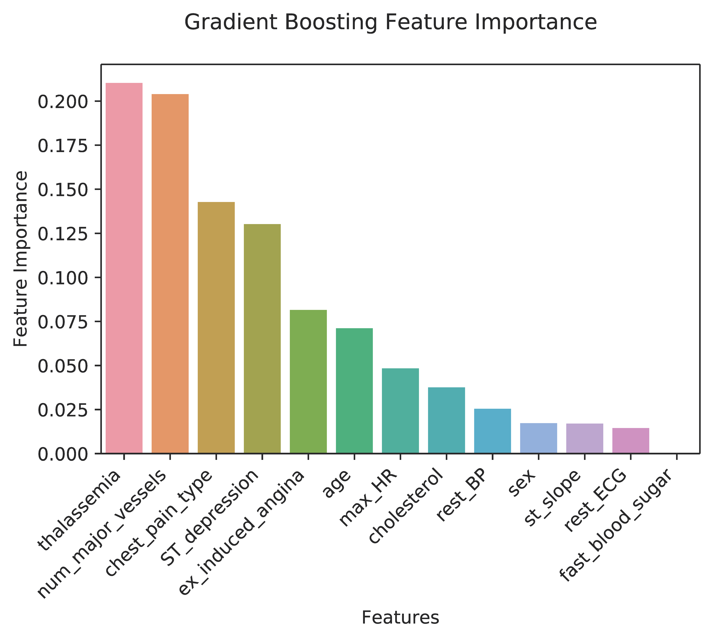
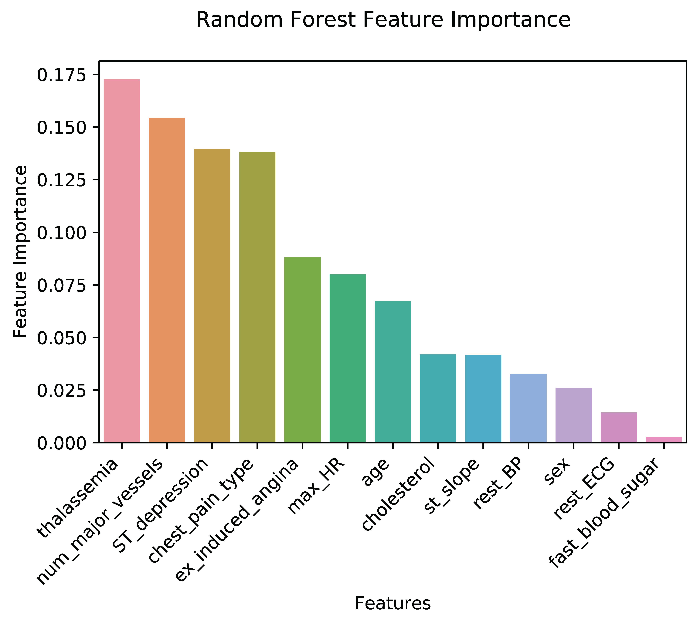
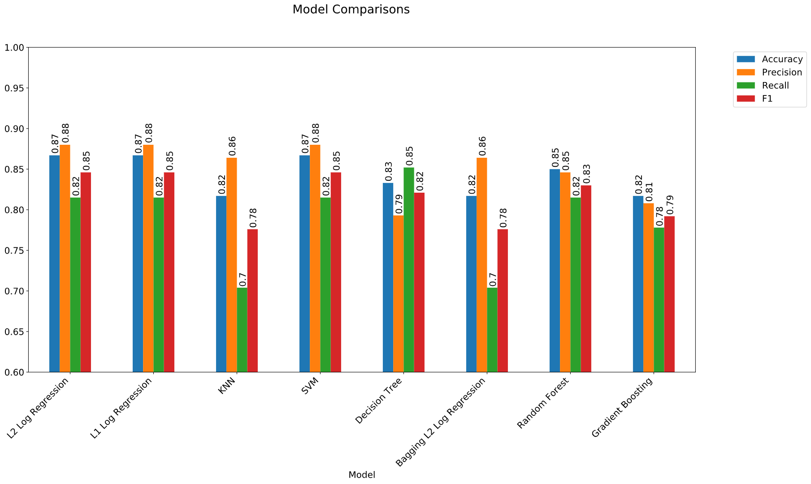

# Predicting Heart Disease

   
### **Please refer to this [notebook]() for a more detailed description, analysis and insights of the project.** ###

## **Project Goals** ##
1. To **predict** heart disease using different machine learning models and choosing the best performance based on the F1 score.
2. Identify the **important features** that predict heart disease

## **Project Overview** ##
* Explored multicollinearity of features 
* Removed outliers using Mahalanobis Distance
* Binarize levels of categorical features to reduce multicollinearity and curse of dimensionality
* Tried out linear, tree-based, and ensemble models using grid search cross validation to find optimal hyperparameters
* Compared the performance of models using F1 score as evaluation metric
* Identified the most important features that contribute to heart disease

## **About this dataset** ##
This data is shared courtesy of the Cleveland Heart Disease Database via the [UCI Machine Learning repository](https://archive.ics.uci.edu/ml/datasets/Heart+Disease). The original dataset contains 76 attributes from 4 studies, but only a subset of 14 from the Cleveland dataset are used by most machine learning practitioners. Thus, we will be using only these 14 features for predicting heart disease.

## **EDA** ##
Among other things, I looked at multicollinearity of the features and some of the relationship with age. Although correlation between variables are not very high, multicollinearity accessed by the variance inflation factor (VIF) is very high.

## **Outlier removal using mahalanobis distance** ##
I chose to used mahalanobis distance to remove outliers as it is a multivariate distance measure and more suited for datasets with multiple features.

## **Feature Importance** ##
I looked at the features that contribute most to predicting heart disease from the random forest and gradient boosting classifiers.
Thalassemia, number of major blood vessel, type of chest pain and ST depression are the top 4 features.

## **Model Comparisons** ##
Logistic Regression and Support Vector Machine performed the best on this dataset, both achieving an F1 score of 84.6%, precision of 88% and recall of 81.5%. Random Forest came in second with a F1 score of 83% while K-Nearest Neighbour performed the worst.

## **Conclusion** ##
To sum up the project, we attempted to predict heart disease using different machine learning models that differ in complexity. Out of all the models, logistic regression and support vector machines performed the best with F1 score of 85% and accuracy of 87%. In the era of big data, this sample size of 300 is considered quite small. With a much more richer dataset, I believe that a better model can be trained.

The second goal was to look at feature importance. Because of high multicollienarity in the features, the feature importance that we obtained from these models should be interpreted cautiously. Nevertheless, it appears that **thalassemia** is consistently the best predictor of heart disease. The number of major blood vessels that are blocked, the type of chest pains, and ST_depression are also good predictors of heart disease.

For a more detailed analyis and description of the project, please refer to this [notebook]()

