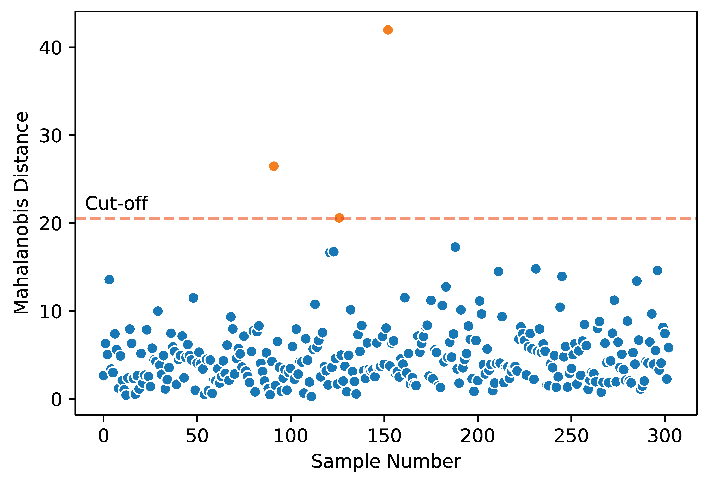

# Predicting Heart Disease

## **Project Goals** ##
1. To **predict** heart disease using different machine learning models and choosing the best performance based on the F1 score.
2. Identify the **important features** that predict heart disease

## **Project Overview** ##
* Explored multicollinearity of features 
* Removed outliers using Mahalanobis Distance
* Binarize levels of categorical features to reduce multicollinearity and curse of dimensionality
* Tried out linear, tree-based, and ensemble models using grid search cross validation to find optimal hyperparameters
* Compared the performance of models using F1 score as evaluation metric
* Identified the most important features that contribute to heart disease

## **About this dataset** ##
This data is shared courtesy of the Cleveland Heart Disease Database via the [UCI Machine Learning repository](https://archive.ics.uci.edu/ml/datasets/Heart+Disease). The original dataset contains 76 attributes from 4 studies, but only a subset of 14 from the Cleveland dataset are used by most machine learning practitioners. Thus, we will be using only these 14 features for predicting heart disease.

## **EDA** ##
Among other things, I looked at multicollinearity of the features and some of the relationship with age. Although correlation between variables are not very high, multicollinearity accessed by the variance inflation factor (VIF) is very high.

## **Outlier removal using mahalanobis distance** ##
I chose to used mahalanobis distance to remove outliers as it is a multivariate distance measure and more suited for datasets with multiple features.

